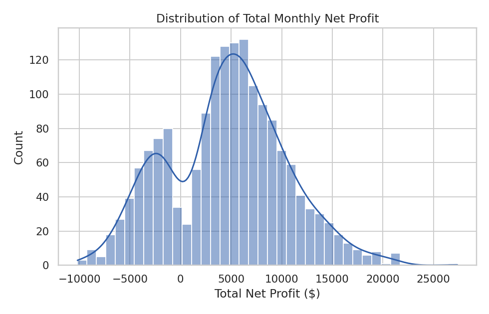
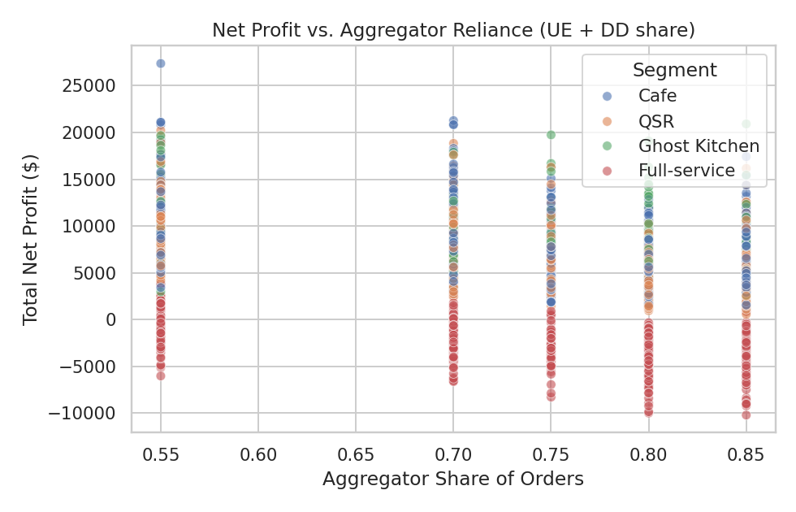
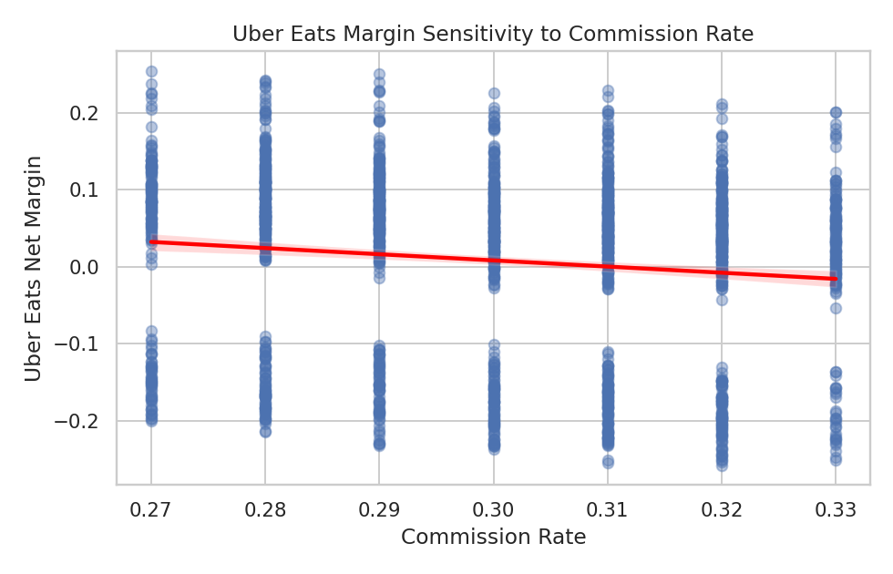
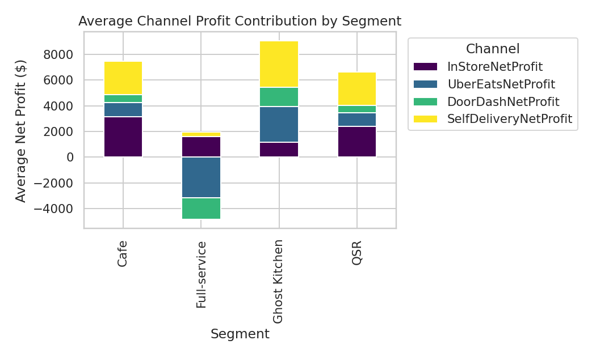
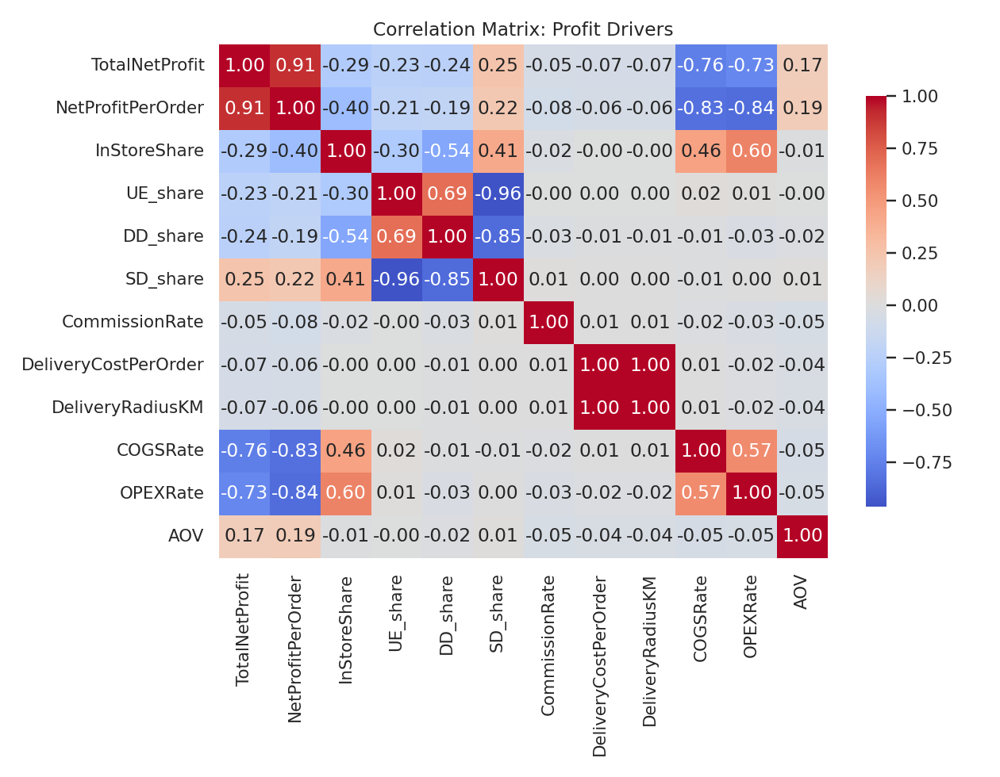
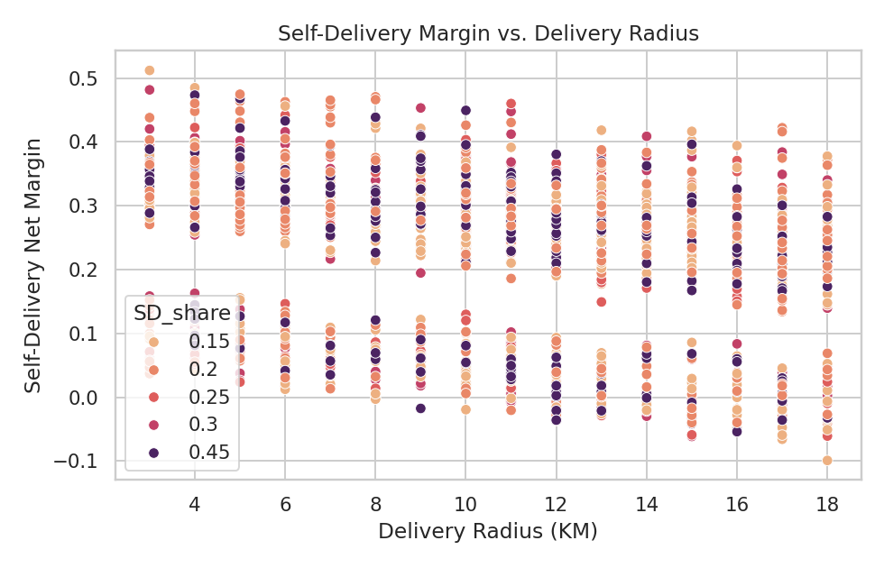
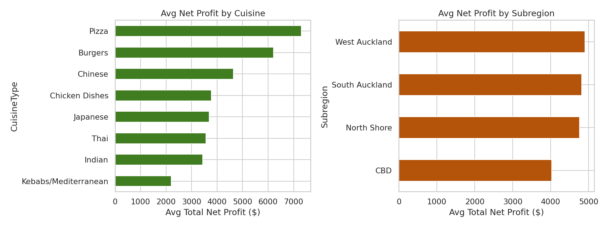

# Predictive Modeling and Profit Optimization for Multi-Channel Restaurant Operations
### A Data Science Study of SkyCity Auckland Restaurants & Bars

**Author:** Pooja Verma
**Project:** Unified Mentor — Data Analyst Track
**Dataset:** SkyCity Auckland Restaurants & Bars (1,696 restaurant-month records)

---

## 1. Abstract

Restaurant operators managing in-store dining alongside third-party delivery
aggregators (Uber Eats, DoorDash) and self-managed delivery face a
recurring strategic question: which channel mix, commission structure, and
delivery cost profile maximizes profit? This study builds a predictive and
prescriptive analytics pipeline on 1,696 SkyCity Auckland restaurant records
to forecast **Total Monthly Net Profit** and **Net Profit per Order**, and to
simulate "what-if" strategic scenarios. An XGBoost Regressor achieved the
best out-of-sample performance (**R² = 0.989, RMSE = $606** on total profit;
**R² = 0.995** on profit-per-order), substantially outperforming a linear
regression baseline (R² = 0.888). A scenario simulation and optimization
engine built on top of the model identifies profit-sensitive levers,
break-even commission rates, and profit-maximizing channel mixes for
individual restaurants — delivered through an interactive Streamlit
dashboard.

---

## 2. Background & Problem Statement

Delivery aggregators drive order volume but compress per-order margins
through commission fees; self-delivery preserves margin but requires
logistics investment (radius, per-order delivery cost, staffing). Small
shifts in channel mix or commission rates can materially move monthly
profit, yet static historical reporting cannot answer forward-looking
"what if" questions, such as:

- What happens if Uber Eats share increases by 10%?
- At what commission rate does self-delivery become the more profitable channel?
- How sensitive is net profit to commission or delivery-radius changes?

This project addresses that gap by combining **predictive modeling**
(profit forecasting) with a **prescriptive simulation layer** (scenario
testing and channel-mix optimization).

---

## 3. Dataset Description

The dataset covers 1,696 unique restaurant records across SkyCity Auckland,
spanning 8 cuisine types (Burgers, Chicken, Chinese, Indian, Japanese,
Kebabs/Mediterranean, Pizza, Thai), 4 business segments (Cafe, QSR,
Ghost Kitchen, Full-service), and 4 subregions (CBD, North Shore, South
Auckland, West Auckland). No missing values were present in the raw data.

Each record captures, per restaurant: order counts and revenue by channel
(in-store, Uber Eats, DoorDash, self-delivery), cost structure (COGS rate
20–40%, OPEX rate 20–55%, aggregator commission rate), self-delivery
economics (delivery radius 3–18km, per-order delivery cost $0.89–$5.31),
channel-level net profit, and channel order-share percentages.

---

## 4. Methodology

### 4.1 Feature Engineering

Beyond the raw fields, the pipeline (`src/feature_engineering.py`) derives:

- **Target variables:** `TotalNetProfit` (sum of channel-level net profits),
  `NetProfitPerOrder`, `NetProfitMargin`, and per-channel margins.
- **Channel revenue ratios:** each channel's share of total revenue.
- **Cost-to-revenue ratios:** `CostToRevenueRatio` = COGS rate + OPEX rate;
  self-delivery cost ratio.
- **Interaction terms:** `CommissionRate × UE_share`,
  `DeliveryCostPerOrder × SD_share`, `CommissionRate × DD_share`,
  `DeliveryRadiusKM × SD_share` — capturing that a cost lever's profit
  impact depends on how much volume flows through that channel.
- **Growth-adjusted demand features:** `MonthlyOrders × GrowthFactor`,
  `AOV × GrowthFactor`.
- **Categorical encoding:** one-hot encoding of CuisineType, Segment, and
  Subregion (16 dummy columns).
- **Outlier handling:** IQR-based clipping (k = 3, conservative) applied to
  the profit targets to limit the influence of extreme margin cases without
  discarding data.

### 4.2 Model Development

Four regression models were trained on an 80/20 train-test split (random
state fixed for reproducibility) and validated with 5-fold cross-validation:

| Model | Role |
|---|---|
| Linear Regression | Interpretability baseline |
| Random Forest Regressor | Non-linear ensemble baseline |
| Gradient Boosting Regressor | Sequential boosting |
| **XGBoost Regressor** | Advanced gradient boosting (final model) |

### 4.3 Evaluation Metrics

Models were compared on **RMSE** (prediction accuracy in dollar terms),
**MAE** (typical absolute error), and **R²** (variance explained), plus
5-fold cross-validated R² to check stability.

---

## 5. Exploratory Data Analysis — Key Insights

Total monthly net profit is broadly distributed with a mean of **$4,638**
and median of **$4,933** across the 1,696 restaurants, with a long right
tail of high-performing outlets.

**Aggregator reliance is negatively associated with profit.** The
correlation between combined Uber Eats + DoorDash order share
(`AggregatorShare`) and total net profit is **−0.25**, while self-delivery
share (`SD_share`) correlates **+0.25** with profit — the mirror image,
since the two are structurally linked (more self-delivery volume means
less aggregator volume in this dataset's design).

Uber Eats net margin trends downward as commission rate rises (correlation
**−0.12**), confirming that commission is a genuine — if not the
single dominant — margin compressor for aggregator channels.

**Ghost Kitchen** is the highest-profit segment on average, followed by
Full-service; QSR and Cafe formats trail. In-store and self-delivery
consistently contribute the largest profit shares across segments, while
aggregator channels contribute smaller — sometimes near-zero or slightly
negative — net margins after commission.

The correlation matrix reveals the **single strongest driver of
profitability is cost structure, not channel mix**: COGS rate
(**−0.76**) and OPEX rate (**−0.73**) correlate far more strongly with
total net profit than any channel-share variable. This is confirmed by the
trained model's feature importance (Section 6).

**Pizza** is the highest-average-profit cuisine and **West Auckland** the
highest-average-profit subregion in this dataset, though these differences
are secondary to cost-structure and channel-mix effects.

---

## 6. Model Results

### 6.1 Total Monthly Net Profit

| Model | RMSE ($) | MAE ($) | R² | CV R² (mean ± std) |
|---|---:|---:|---:|---:|
| Linear Regression | 1,901.41 | 1,323.90 | 0.888 | 0.558 ± 0.600 |
| Random Forest | 1,045.08 | 752.01 | 0.966 | 0.959 ± 0.014 |
| Gradient Boosting | 734.94 | 545.44 | 0.983 | 0.974 ± 0.006 |
| **XGBoost (selected)** | **606.13** | **444.05** | **0.989** | **0.984 ± 0.007** |

### 6.2 Net Profit per Order

| Model | RMSE ($) | MAE ($) | R² | CV R² (mean ± std) |
|---|---:|---:|---:|---:|
| Linear Regression | 0.52 | 0.38 | 0.985 | 0.983 ± 0.003 |
| Random Forest | 0.49 | 0.39 | 0.987 | 0.977 ± 0.011 |
| Gradient Boosting | 0.34 | 0.26 | 0.994 | 0.988 ± 0.006 |
| **XGBoost (selected)** | **0.29** | **0.22** | **0.995** | **0.990 ± 0.006** |

XGBoost was selected for both targets: it has the lowest error and highest
(and most stable) cross-validated R² of all four candidates. The gap
between linear regression's single-split R² (0.888) and its much lower
cross-validated R² (0.558 ± 0.600) shows the true relationship between
inputs and profit is meaningfully non-linear — consistent with the
interaction-heavy structure of channel-mix economics — which the boosted
tree models capture far better.

### 6.3 Feature Importance (XGBoost, Total Net Profit)

| Rank | Feature | Importance |
|---:|---|---:|
| 1 | CostToRevenueRatio (COGS + OPEX) | 0.367 |
| 2 | Segment = Full-service | 0.145 |
| 3 | GrowthAdjustedOrders | 0.109 |
| 4 | COGSRate | 0.089 |
| 5 | MonthlyOrders | 0.054 |
| 6 | UE_share | 0.051 |
| 7 | CommissionRate × DD_share | 0.042 |
| 8 | SD_share | 0.042 |
| 9 | CommissionRate × UE_share | 0.021 |
| 10 | AOV × GrowthFactor | 0.019 |

**Takeaway:** cost efficiency (COGS + OPEX as a share of revenue) is by far
the largest lever on profit — more than double the next-largest feature —
followed by business-model segment and order-volume growth. Channel-mix
and commission variables matter, but as second-order effects relative to
underlying cost structure.

---

## 7. Scenario Simulation & Prescriptive Optimization

Built in `src/simulation.py` and exposed through the Streamlit app:

1. **Profit Sensitivity Index** — the % change in predicted profit from a
   +10% relative change in each decision variable (channel shares,
   commission rate, delivery cost, delivery radius), holding others fixed.
   Across sampled restaurants, channel-share variables (UE/DD/SD share)
   typically produce the largest swings (~9% per test restaurant), with
   commission rate a secondary but consistent negative driver.
2. **Break-Even Commission Rate** — the commission rate at which a
   restaurant's predicted total net profit reaches zero, found by scanning
   commission rates from 0–80% holding all other inputs fixed. This is
   reported per restaurant as a concrete negotiation benchmark.
3. **Channel-Mix Optimization** — a grid search (5% increments) over
   feasible `{InStoreShare, UE_share, DD_share, SD_share}` combinations
   (summing to 100%) identifies the profit-maximizing mix for a given
   restaurant's cost structure, and reports the **Optimization Uplift (%)**
   versus its current strategy. In the example restaurant tested during
   development, the optimizer identified a **14.1% profit uplift**
   by shifting toward a higher in-store / self-delivery mix and away from
   aggregator channels.

---

## 8. Streamlit Dashboard

`app/streamlit_app.py` implements the four required modules:

- **Profit Prediction Dashboard** — baseline vs. scenario profit, channel
  mix comparison, and a confidence band (± model RMSE).
- **Channel Mix Sliders** — interactive what-if controls for all four
  channel shares (auto-normalized to 100%) plus commission, delivery
  cost, delivery radius, and growth factor.
- **Cost Sensitivity Visualizations** — Profit Sensitivity Index chart and
  break-even commission rate.
- **Optimization Recommendation Panel** — grid-search optimizer with
  uplift %, comparing current vs. optimal channel mix.

A fifth **Portfolio Overview** tab gives dataset-wide context (profit
distribution, segment comparison, aggregator-reliance scatter) so a single
restaurant's scenario can be read against the full SkyCity portfolio.

---

## 9. Limitations & Future Work

- The dataset is cross-sectional (one snapshot per restaurant) rather than
  a true monthly time series; the simulation engine treats `GrowthFactor`
  as a static multiplier rather than modeling temporal demand dynamics.
- Channel-mix optimization assumes independence between share changes and
  cost parameters (e.g., it does not model how shifting to higher
  self-delivery share might itself require radius or staffing cost
  increases beyond what's captured in `DeliveryCostPerOrder`).
- Break-even commission search holds all other variables fixed — real
  aggregator negotiations may involve bundled changes to visibility,
  order volume, or minimum-order terms not present in this dataset.
- Future work could incorporate true panel/time-series data to model
  seasonality and demand elasticity directly, and extend the optimizer to
  a constrained (e.g., operationally feasible radius/staffing) rather
  than unconstrained grid search.

---

## 10. Conclusion

This project moves SkyCity Auckland Restaurants & Bars from static
historical reporting to predictive and prescriptive profit intelligence.
An XGBoost model explains ~99% of variance in total net profit out of
sample, and the accompanying simulation engine translates that model into
concrete, restaurant-specific answers to the strategic questions posed at
the outset — channel-mix sensitivity, break-even commission rates, and
profit-maximizing channel allocations — delivered through a live,
interactive dashboard.
